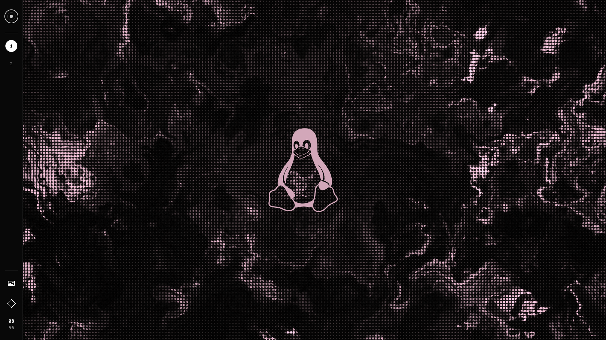
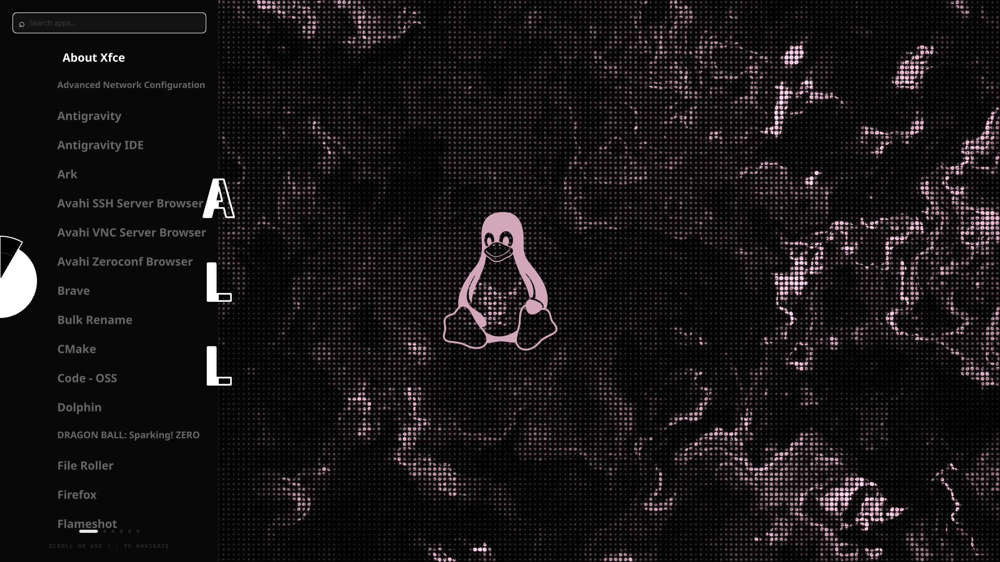
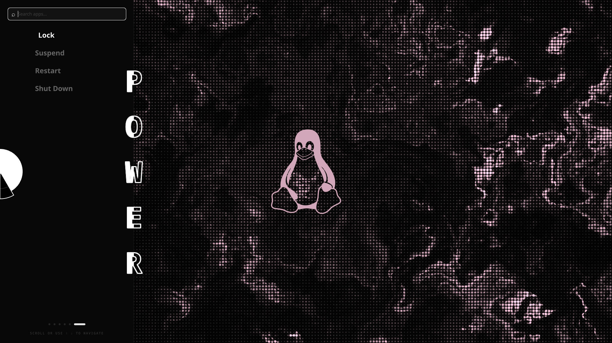
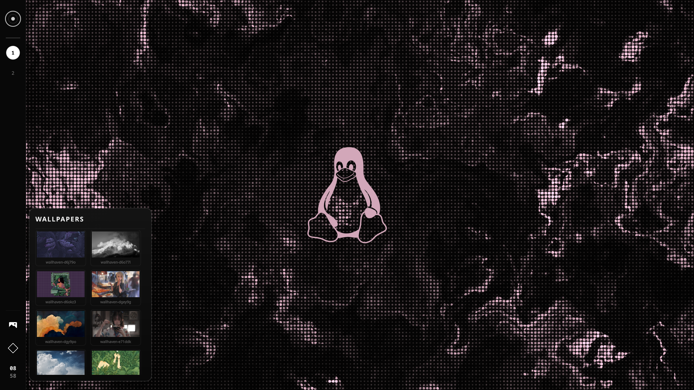
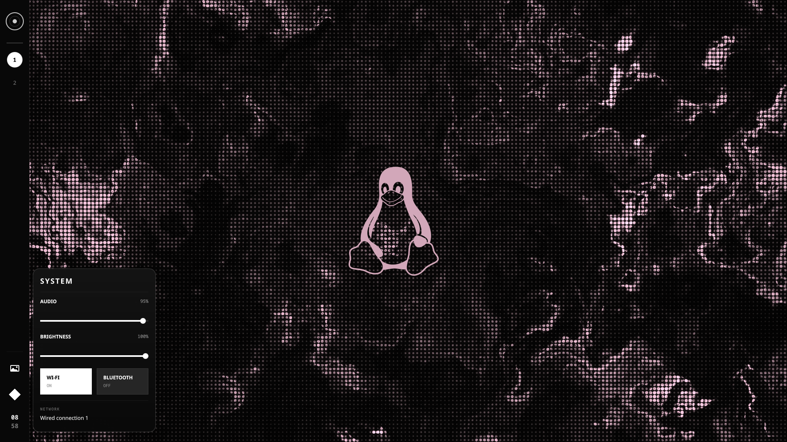

# BaiOS

> A monochrome Arch-based Linux distribution focused on design, productivity, development and gaming.

BaiOS is a custom Linux distribution built on top of **Arch Linux**, using **Hyprland** as its Wayland compositor and **Quickshell/QML** as the foundation for its custom desktop shell.

The project focuses on creating a distinctive desktop experience rather than simply customizing an existing desktop environment.

*Every pixel has a purpose.*

---

## Developer Preview

- **Current version:** `v0.1.0-dev`
- **Status:** Developer Preview
- **Architecture:** `x86_64`

BaiOS 0.1 is the first developer preview of the project. It provides a complete bootable environment with a custom desktop shell, application launcher, workspace navigation, and system controls.

---

## Screenshots

---

## Features

### BaiShell

BaiShell is the custom desktop shell developed specifically for BaiOS using **Quickshell** and **QML**.

- **BaiCore** — Central interaction element and visual identity
- **BaiHub** — Application and system navigation interface
- **BaiPanel** — Section and application navigation
- **BaiRail** — Vertical workspace and system navigation bar
- **BaiControl** — System control interface
- Keyboard navigation
- Mouse interaction
- Animated transitions
- Monochrome visual system

### BaiHub

BaiHub provides centralized access to the main areas of the system.

Current sections:

- APPS
- GAMES
- DEVELOPMENT
- SYSTEM
- POWER
